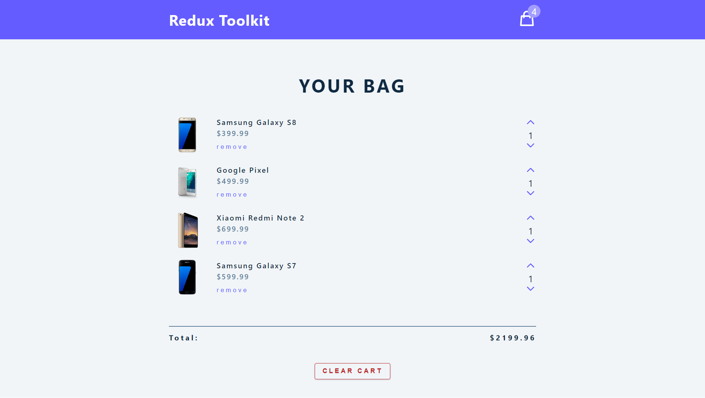

<p align='center'>


</p>
<p align='center'>
<b>A single-page cart using built with <a href='https://reactjs.org/' target='_blank'>React.js</a> and <a href='https://redux-toolkit.js.org/' target='_blank'>Redux-Toolkit</a></b>
</p>
<p align='center'>
<a href='https://react-reduxtoolkit-cart.netlify.app/' target='_blank'>https://react-reduxtoolkit-cart.netlify.app</a>
</p>

---

<p align='center'>
This is the frontend of React-Redux Cart build with <a href='https://reactjs.org/' target='_blank'>React.js</a> and deployed with <a href='https://www.netlify.com/' target='_blank'>Netlify</a>
</p>

<p align='center'>

</p>

## 🧾 Description

This is project is created for learning the basics of redux-toolkit.

## ⚙ Tools and Technologies used

1. [React.js](https://reactjs.org/)
2. [React-icons](https://react-icons.github.io/react-icons/)
3. [Redux-Toolkit](https://redux-toolkit.js.org/)

## 🛠 Installation and setup

1. Clone the repo to your local machine.
2. Install the required dependency for server using :

   ```javascript
   npm install
   ```

3. Start the dev server using :

   ```javascript
   npm start
   ```

## 🏎 Creating production built

1. Create a production ready react app using the command :

   ```javascript
   npm run build
   ```

## 😎 Developed by

<table>
  <tr>
    <td align="center">
      
      <br/>
      Varun Kumar Tiwari
      <br/>
      <a href="https://www.linkedin.com/in/varun-tiwari-454591178/">LinkedIn</a>
      <a href="https://github.com/varunKT001">Github</a>
    </td> 
  </tr>
</table>
